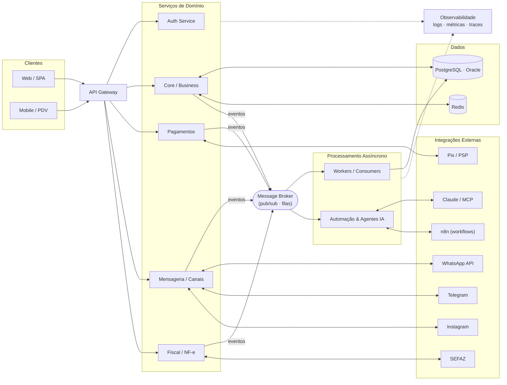

<h1 align="center">GussCloud</h1>

  <b>Arquitetura de Soluções</b> · Sistemas distribuídos, integrações e plataformas escaláveis

  
  
  
  

###

 

## 🧭 Sobre

Atuo com **arquitetura de soluções**, desenhando sistemas que precisam ser **escaláveis, resilientes e integráveis**. Meu foco está em traduzir necessidades de negócio em arquiteturas técnicas sustentáveis — do desenho de domínio e contratos de API até decisões de infraestrutura, dados e integração entre sistemas.

> Boa arquitetura não é a mais complexa — é a que resolve o problema certo com o menor acoplamento possível.

###

## 🏛️ Pilares de Arquitetura

| Domínio | Foco |
|---|---|
| **Sistemas Distribuídos** | Microsserviços, comunicação assíncrona, idempotência, consistência eventual |
| **Arquitetura Orientada a Eventos** | Message brokers, filas, pub/sub, choreography vs. orchestration |
| **API & Integração** | REST, contratos bem definidos, API Gateway, webhooks, integrações entre sistemas |
| **Dados** | Modelagem relacional, polyglot persistence, estratégias de cache e leitura |
| **Cloud & Infra** | Containers, escalabilidade horizontal, observabilidade, automação |
| **IA & Automação** | Orquestração de agentes, integração com LLMs (MCP), automação de fluxos |

###

## 🧩 Padrões & Práticas

  
  
  
  
  
  
  
  

###

## 🗺️ Arquitetura de Referência

Visão de uma plataforma real que projeto: **orientada a eventos**, com **API Gateway**, serviços desacoplados, mensageria assíncrona, integrações com canais e provedores, e observabilidade ponta a ponta.

###

## 🛠️ Stack Técnica

**Linguagens & Runtime**

  
  
  
  
  
  
  

**Dados & Persistência**

  
  
  
  
  
  
  
  
  
  
  

**Infra & Plataforma**

  
  
  
  
  
  
  
  
  

###

## 📊 Atividade

<picture>
  <source media="(prefers-color-scheme: dark)" srcset="https://raw.githubusercontent.com/GussCloud/GussCloud/output/snake-dark.svg">
  <source media="(prefers-color-scheme: light)" srcset="https://raw.githubusercontent.com/GussCloud/GussCloud/output/snake.svg">
  
</picture>

###
